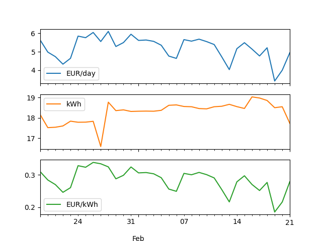

# PVPC + Kasa smart plugs + Nicehash

This script calculates the cost-effectiveness of mining. It queries historical data from a *TP-Link HS110* smart plug, queries average cost/day of the electricity (Spanish grid only for now, PVPC) and also queries Nicehash's API in order to get bitcoin produced per day on my machines.

## Getting started

---

You can install the most recent release using pip while in the project root:

`pip install .`

Then you'll need to install its dependencies using:

`pip3 install -r requirements.txt`

Finally, run it by:

```
$ python3 pvpc-knh
Current power consumption (W): emeterstatus
Query failed due to data not available for that date: 2022-01-12 00:00:00
----------------
Energy consumption by day (kWh): {1: 7.101, 2: 12.593, 3: 10.4, 4: 11.76, 5: 13.2, 6: 9.92, 7: 10.342, 8: 11.134, 9: 10.234, 10: 12.756, 11: 13.392}
Energy cost by day (Euros/kWh): {1: 0.1782, 2: 0.187, 3: 0.2366, 4: 0.2399, 5: 0.2723, 6: 0.2768, 7: 0.3172, 8: 0.2675, 9: 0.1684, 10: 0.3193, 11: 0.3229}
Cost in Euros/day: {1: 1.2653982, 2: 2.354891, 3: 2.46064, 4: 2.821224, 5: 3.5943599999999996, 6: 2.745856, 7: 3.2804824, 8: 2.9783450000000005, 9: 1.7234056, 10: 4.0729907999999995, 11: 4.3242768, 'sum': 31.6218698}
----------------
Total cost in Euros: 31.6218698
```



## Requirements and supported devices

---

* TP-Link Kasa smart plug, this code has been tested with the HS110
* Nicehash API private token

### Plugs

* HS100
* HS103
* HS105
* HS107
* HS110
* KP105
* KP115
* KP401

## TODO:

* We don't use 'ESIOS API' because it requires an API token, we use a web scraper on
  [https://tarifaluzhora.es/](https://tarifaluzhora.es/?tarifa=pcb&fecha=10%2F01%2F2022) instead. This is slower,
  but it is easier to set up.
* CLI doesn't have any parameters yet.
* Nicehash API
* Tidy the code for the plot function.

## Resources

---

### Links

[Reverse engineering the TP-Link HS110](https://www.softscheck.com/en/reverse-engineering-tp-link-hs110/)

[TP-Link WiFi SmartPlug Client and Wireshark Dissector](https://github.com/softScheck/tplink-smartplug)

[Python-kasa GitHub repository](https://github.com/python-kasa/python-kasa)
